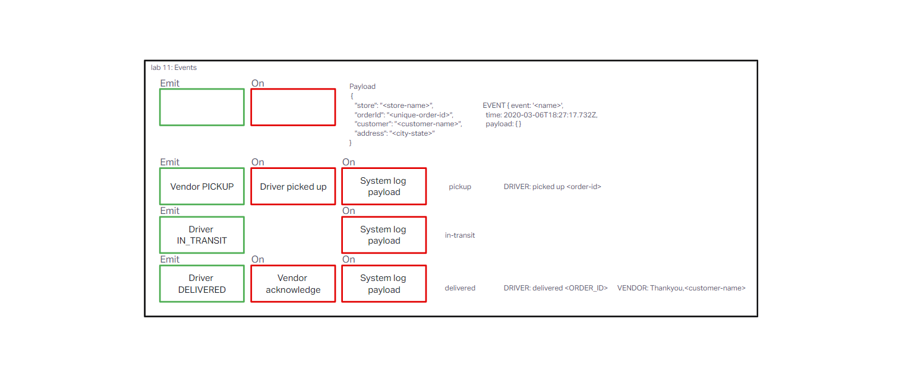

# LAB - Class 11

## Project: CAPS

### Author: Brandon Perard

### Problem Domain  

A real-time service that allows for vendors, such as flower shops or restaurants, to alert a system of a package needing to be delivered, for drivers to instantly see what’s in their pickup queue, and then to alert the vendors as to the state of the deliveries (in transit, and then delivered).

### Links and Resources

- [GitHub Actions ci/cd](https://github.com/bperard/caps/actions)
<!-- - [back-end server url](http://xyz.com) (when applicable)
- [front-end application](http://xyz.com) (when applicable) -->

### Setup

#### `.env` requirements (where applicable)

for now I have none and do not require one

#### How to initialize/run your application (where applicable)

- e.g. `npm start`

#### How to use your library (where applicable)

#### Features / Routes

- Phase 1: Events and Hanler functions

#### Tests

- Driver-handler functions tested
- Vendor-handler functions tested

#### UML

